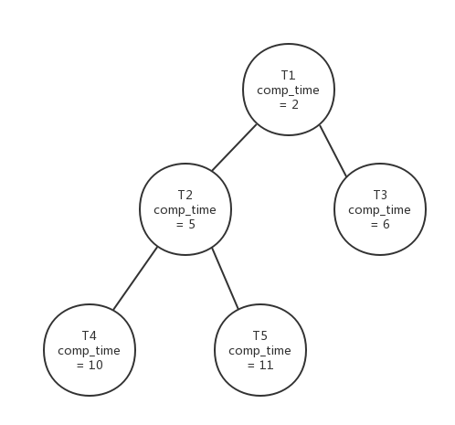
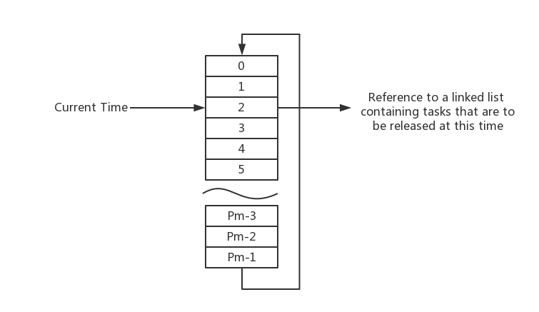

# ucos_ii_with_improved_edf_scheduling
大三第二学期嵌入式系统概论课程实验：为windows移植版ucos_ii添加edf调度。
## 1. 实验环境
本次实验使用的RTOS是ucos_ii的windows移植版，ucos_ii版本号为2.92.11，使用visual studio 2013进行开发。
## 2. 实验目的
修改移植版ucos_ii的代码，为其添加EDF调度。ucos_ii原本是使用基于固定优先级的RMS调度，而EDF是基于截至时限的一种可抢占式调度，拥有更高的CPU利用率。希望通过本次实验加深对这两种调度算法的理解。
## 3. 基本EDF的调度实现
首先需要定义EDF调度所需要的数据结构。因为EDF调度需要知道每个任务的周期以及截至实现等信息，所以需要在ucos_ii本身的OS_TCB中添加这部分的数据。而正好原本的OS_TCB中就预留了一个(void *)类型的指针—OSTCBExtPtr，用来指向需要扩展的数据结构，因此可以使用这个来扩充我们需要的数据。

添加一个OS_TASK_EDF_EN的预定义宏，当它不为0时则开启EDF调度，否则还使用原本的RMS调度，这样可以方便切换。

添加一个OS_TaskIsrt (OS_TCB *ptcb)方法，使用原本程序中的OSTCBList数组，将其改为一个有序的链表，其中的OS_TCB按照其截限时间排序，OS_TashIsrt方法就负责将执行完等待下一个周期的任务或者刚刚创建的任务插入这个有序链表中。

将原本的代码中使用OS_SchedNew()方法的地方换成OS_SchedEDF()，OS_SchedEDF()方法从已经排好序的OSTCBList中选择最前的非Dely状态的task，并将其优先级赋值给OSPrioHighRdy，然后OS_Sched进行任务切换。

## 4. 改进的EDF调度
以上的基本实现中由于使用链表维护任务的先后顺序，所以具有O(n)的时间复杂度。改进算法将链表改为一个平衡二叉树构成的优先队列和一个时间轮结构数组。其中优先队列存放当前处于就绪状态的任务，它按照任务的截限时间进行排序并调度执行；时间轮中存储着在不同时间释放的等待任务，其中Pm是所有任务中周期的最大值。

  
就绪任务优先队列

  
等待任务时间轮

在每个时钟周期中，令current_time = (current_time + 1) % Pm，检查数组当前项结构体中的OS_TCB指针是否指向一个待释放的任务链表，如果有，则将其移入就绪任务优先队列，如果队首任务发生了改变则进行任务抢占，否则继续执行。当一个任务在本周期执行完成时，将其移入下一个释放时间对应的时间轮的任务链表中。
